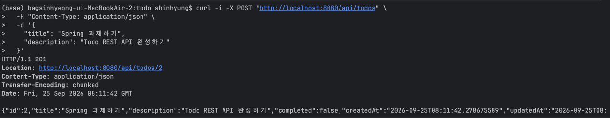
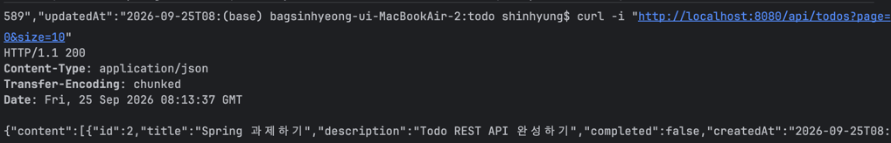
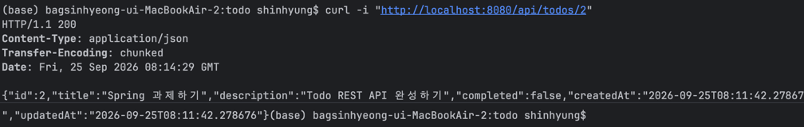
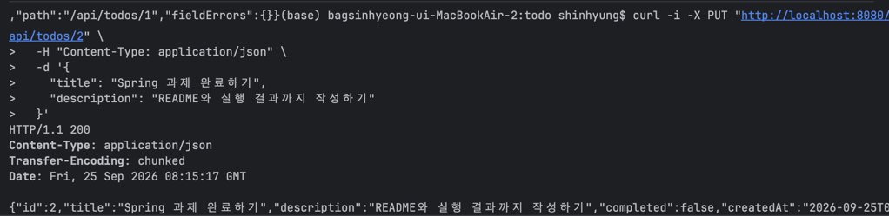
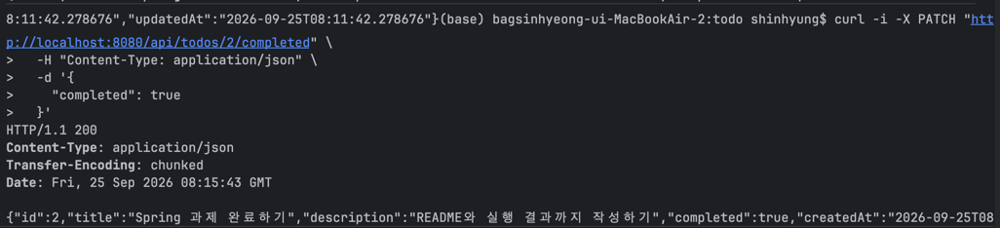
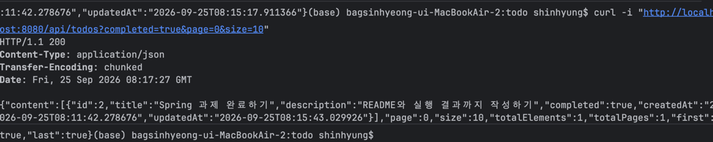
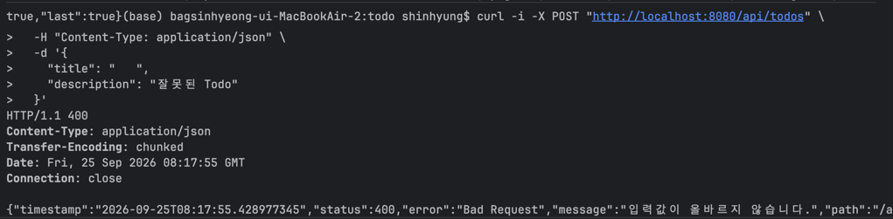
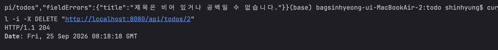
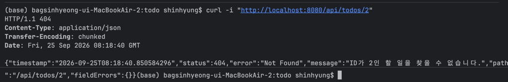

# Spring 으로 할 일 백엔드 API 만들기

## 1. 실행 방법

```bash
docker compose up --build
```

PostgreSQL은 Docker Compose가 자동으로 생성하므로 직접 설치하거나 DB 계정을 만들 필요가 없도록 했습니다.
- JDK 21
- Docker Desktop
- Docker Compose

서버주소 : http://localhost:8080

---

## 2. API 명세

- 기본 주소: http://localhost:8080/api/todos
- Swagger UI:   http://localhost:8080/swagger-ui.html

[0] 전체 API 요약

| 번호 | 기능 | 메서드 | 주소 | 성공 상태 코드 |
|---:|---|---|---|---|
| 1 | 할 일 생성 | `POST` | `/api/todos` | `201 Created` |
| 2 | 할 일 목록 조회 | `GET` | `/api/todos` | `200 OK` |
| 3 | 할 일 상세 조회 | `GET` | `/api/todos/{id}` | `200 OK` |
| 4 | 할 일 수정 | `PUT` | `/api/todos/{id}` | `200 OK` |
| 5 | 완료 여부 수정 | `PATCH` | `/api/todos/{id}/completed` | `200 OK` |
| 6 | 할 일 삭제 | `DELETE` | `/api/todos/{id}` | `204 No Content` |

---

[1] 할 일 생성

| 항목 | 내용 |
|---|---|
| 메서드 | `POST` |
| 주소 | `/api/todos` |
| 요청 본문 | <pre><code>{<br>  "title": "Spring 과제하기",<br>  "description": "Todo REST API 완성하기"<br>}</code></pre> |
| 응답 본문 | <pre><code>{<br>  "id": 1,<br>  "title": "Spring 과제하기",<br>  "description": "Todo REST API 완성하기",<br>  "completed": false,<br>  "createdAt": "2026-09-25T16:14:06.61006",<br>  "updatedAt": "2026-09-25T16:14:06.61006"<br>}</code></pre> |
| 성공 상태 코드 | `201 Created` |
| 오류 상태 코드 | `400 Bad Request` |

제목은 필수이며 공백일 수 없고 최대 100자입니다. 설명은 선택값이며 최대 500자입니다.

---
[2] 할 일 목록 조회

| 항목 | 내용 |
|---|---|
| 메서드 | `GET` |
| 주소 | `/api/todos?page=0&size=10&completed=false` |
| 쿼리 파라미터 | `page`: 페이지 번호, 기본값 `0`<br>`size`: 페이지당 항목 수, 기본값 `10`, 최대 `100`<br>`completed`: 완료 여부 필터, `true` 또는 `false`, 생략 가능 |
| 요청 본문 | 없음 |
| 응답 본문 | <pre><code>{<br>  "content": [<br>    {<br>      "id": 1,<br>      "title": "Spring 과제하기",<br>      "description": "Todo REST API 완성하기",<br>      "completed": false,<br>      "createdAt": "2026-09-25T16:14:06.61006",<br>      "updatedAt": "2026-09-25T16:14:06.61006"<br>    }<br>  ],<br>  "page": 0,<br>  "size": 10,<br>  "totalElements": 1,<br>  "totalPages": 1,<br>  "first": true,<br>  "last": true<br>}</code></pre> |
| 성공 상태 코드 | `200 OK` |
| 오류 상태 코드 | `400 Bad Request` |

`completed`를 생략하면 전체 목록을 조회합니다.

```text
전체 조회:  GET /api/todos?page=0&size=10
완료 조회:  GET /api/todos?completed=true&page=0&size=10
미완료 조회: GET /api/todos?completed=false&page=0&size=10
```

---

[3] 할 일 상세 조회

| 항목 | 내용 |
|---|---|
| 메서드 | `GET` |
| 주소 | `/api/todos/{id}` |
| 경로 변수 | `id`: 조회할 Todo의 식별자 |
| 요청 본문 | 없음 |
| 응답 본문 | <pre><code>{<br>  "id": 1,<br>  "title": "Spring 과제하기",<br>  "description": "Todo REST API 완성하기",<br>  "completed": false,<br>  "createdAt": "2026-09-25T16:14:06.61006",<br>  "updatedAt": "2026-09-25T16:14:06.61006"<br>}</code></pre> |
| 성공 상태 코드 | `200 OK` |
| 오류 상태 코드 | `404 Not Found` |

---

[4] 할 일 수정

| 항목 | 내용 |
|---|---|
| 메서드 | `PUT` |
| 주소 | `/api/todos/{id}` |
| 경로 변수 | `id`: 수정할 Todo의 식별자 |
| 요청 본문 | <pre><code>{<br>  "title": "Spring 과제 완료하기",<br>  "description": "README까지 작성하기"<br>}</code></pre> |
| 응답 본문 | <pre><code>{<br>  "id": 1,<br>  "title": "Spring 과제 완료하기",<br>  "description": "README까지 작성하기",<br>  "completed": false,<br>  "createdAt": "2026-09-25T16:14:06.61006",<br>  "updatedAt": "2026-09-25T16:20:00.123456"<br>}</code></pre> |
| 성공 상태 코드 | `200 OK` |
| 오류 상태 코드 | `400 Bad Request`, `404 Not Found` |

---

[5] 완료 여부 수정

| 항목 | 내용 |
|---|---|
| 메서드 | `PATCH` |
| 주소 | `/api/todos/{id}/completed` |
| 경로 변수 | `id`: 완료 여부를 변경할 Todo의 식별자 |
| 요청 본문 | <pre><code>{<br>  "completed": true<br>}</code></pre> |
| 응답 본문 | <pre><code>{<br>  "id": 1,<br>  "title": "Spring 과제하기",<br>  "description": "Todo REST API 완성하기",<br>  "completed": true,<br>  "createdAt": "2026-09-25T16:14:06.61006",<br>  "updatedAt": "2026-09-25T16:16:24.774535"<br>}</code></pre> |
| 성공 상태 코드 | `200 OK` |
| 오류 상태 코드 | `400 Bad Request`, `404 Not Found` |

---

[6] 할 일 삭제

| 항목 | 내용 |
|---|---|
| 메서드 | `DELETE` |
| 주소 | `/api/todos/{id}` |
| 경로 변수 | `id`: 삭제할 Todo의 식별자 |
| 요청 본문 | 없음 |
| 응답 본문 | 없음 |
| 성공 상태 코드 | `204 No Content` |
| 오류 상태 코드 | `404 Not Found` |

---

### 오류 응답 형식

[1] 400 Bad Request

| 항목 | 내용 |
|---|---|
| 발생 조건 | 제목이 비어 있거나 공백인 경우, 제목이나 설명이 최대 길이를 초과한 경우, 요청 형식이 잘못된 경우 |
| 상태 코드 | `400 Bad Request` |
| 응답 본문 | <pre><code>{<br>  "timestamp": "2026-09-25T16:30:00",<br>  "status": 400,<br>  "error": "Bad Request",<br>  "message": "입력값이 올바르지 않습니다.",<br>  "path": "/api/todos",<br>  "fieldErrors": {<br>    "title": "제목은 비어 있거나 공백일 수 없습니다."<br>  }<br>}</code></pre> |

[2] 404 Not Found

| 항목 | 내용 |
|---|---|
| 발생 조건 | 조회, 수정 또는 삭제하려는 Todo ID가 존재하지 않는 경우 |
| 상태 코드 | `404 Not Found` |
| 응답 본문 | <pre><code>{<br>  "timestamp": "2026-09-25T16:31:00",<br>  "status": 404,<br>  "error": "Not Found",<br>  "message": "ID가 999999인 할 일을 찾을 수 없습니다.",<br>  "path": "/api/todos/999999",<br>  "fieldErrors": {}<br>}</code></pre> |


---

## 3. 설계 설명

[1] API 주소

Todo 리소스의 기본 주소는 복수형 명사인 `/api/todos`로 정했습니다. `/api/todos`는 Todo 목록을 나타내며 `/api/todos/{id}`는 특정 Todo 하나를 나타냅니다. 생성, 조회, 수정, 삭제는 동일한 주소에 `POST`, `GET`, `PUT`, `DELETE` HTTP 메서드로 구분했습니다. 완료 여부 변경은 Todo 전체가 아닌 일부 속성만 변경하므로 `PATCH /api/todos/{id}/completed`로 설계했습니다.

[2] 상태 코드

| 상태 코드 | 선택 이유 |
|---|---|
| `200 OK` | 조회 또는 수정이 성공하고 응답 본문을 반환할 때 사용 |
| `201 Created` | 새로운 Todo가 생성됐을 때 사용 |
| `204 No Content` | 삭제가 성공했으며 반환할 본문이 없을 때 사용 |
| `400 Bad Request` | 제목 검증 실패 또는 잘못된 요청 형식에 사용 |
| `404 Not Found` | 요청한 ID의 Todo가 존재하지 않을 때 사용 |
| `500 Internal Server Error` | 예상하지 못한 서버 내부 오류에 사용 |

[3] DB 선택

과제에서 요구하는 구조가 명확하기 때문에 관계형 데이터베이스가 적합하다고 판단하여 PostgreSQL을 사용하세 되었습니다. 
또한, Docker Compose를 사용하므로 PostgreSQL 설치, DB 생성 및 계정 생성을 직접 수행하지 않아도 동일한 개발 환경을 실행할 수 있습니다.

---

## 4. 실행 결과

[1] 할 일 생성



[2] 할 일 목록 조회



### [3] 할 일 상세 조회



### [4] 할 일 수정



### [5] 완료 여부 수정




### [6] 완료 여부 필터 조회



### [7] 잘못된 입력 요청



### [8] 할 일 삭제



### [9] 존재하지 않는 할 일 조회

